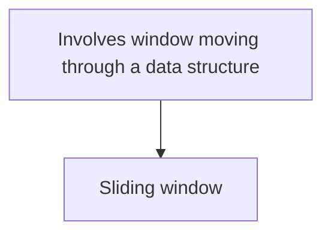

# Brute-force search vs exhaustive search

- Exhaustive search is a brute-force approach applied to combinatorial problems. (https://dev.to/akashdev23/brute-force-algorithms-the-power-of-exhaustive-search-1bab)

# Greedy algorithms vs exhaustive algorithm

- **Greedy algorithm**
  - "follows the problem-solving heuristic of making the locally optimal choice at each stage"(https://en.wikipedia.org/wiki/Greedy_algorithm)
  - e.g.,(https://www.geeksforgeeks.org/introduction-to-greedy-algorithm-data-structures-and-algorithm-tutorials/)
    - Dijkstra’s Algorithm: SSSP(Single source shortest path)
    - Kruskal’s Algorithm: MST(Minimum Spanning Tree)
    - Fractional Knapsack Problem
    - Huffman Coding
- **Exhaustive algorithm**
  - "systematically checking all possible candidates for whether or not each candidate satisfies the problem's statement"(https://en.wikipedia.org/wiki/Brute-force_search)

# Interval Scheduling

https://en.wikipedia.org/wiki/Interval_scheduling

## Unweighted 

- Can be solved by a greedy algorithm "Earliest deadline first scheduling"(https://en.wikipedia.org/wiki/Earliest_deadline_first_scheduling)

## Weighted

# Array manipulation

## Rotate an array

- e.g., [1,2,3,4,5] -> [4,5,1,2,3] by rotating 2 times to the right.
- Algorithms(https://www.geeksforgeeks.org/complete-guide-on-array-rotations/)
  - **Rotate one by one**
    - Time complexity: O(n * d)
    - Space complexity: O(1)
  - **Using temporary Array**
    - Time complexity: O(n)
    - Space complexity: O(n)
  - **Juggling Algorithm**
    - Time complexity: O(n)
    - Space complexity: O(1)
  - **The Reversal Algorithm**
    - Time complexity: O(n)
    - Space complexity: O(1)

# Knapsack Problems

- Knapsack problems are a family of combinatorial optimization problems. (https://en.wikipedia.org/wiki/Knapsack_problem)
- "Given a bag with maximum weight capacity of W and a set of items, each having a weight and a value associated with it. Decide the number of each item to take in a collection such that the total weight is less than the capacity and the total value is maximized."(https://www.geeksforgeeks.org/introduction-to-knapsack-problem-its-types-and-how-to-solve-them/)

There are some patterns.

## Fractional Knapsack Problem

## 0/1 Knapsack Problem

## Bounded Knapsack Problem(BKP)

## Unbounded Knapsack Problem(UKP)

# Sliding Window(find min array that meets specific conditions)

- https://www.geeksforgeeks.org/window-sliding-technique/
- https://www.geeksforgeeks.org/length-of-the-longest-substring-without-repeating-characters/
- e.g., [minimum_size_subarray_sum](leetcode/minimum_size_subarray_sum.py)

# Maximum diff between two elements in an array

- https://www.geeksforgeeks.org/best-time-to-buy-and-sell-stock/
- e.g., [best_time_to_buy_and_sell_stock](leetcode/best_time_to_buy_and_sell_stock.py)

# Decision making which algorithm to apply

if problems in which a fixed or variable-size window is moved through a data structure, typically an array or string, to solve problems efficiently based on continuous subsets of elements:
  then sliding window algorithms.

  if 

else if combinatorial optimization problems:
  then greedy algorithms or exhaustive algorithms.

